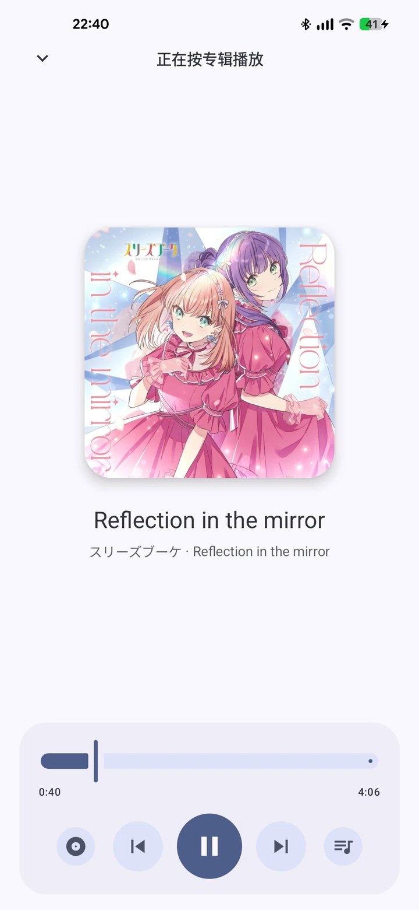
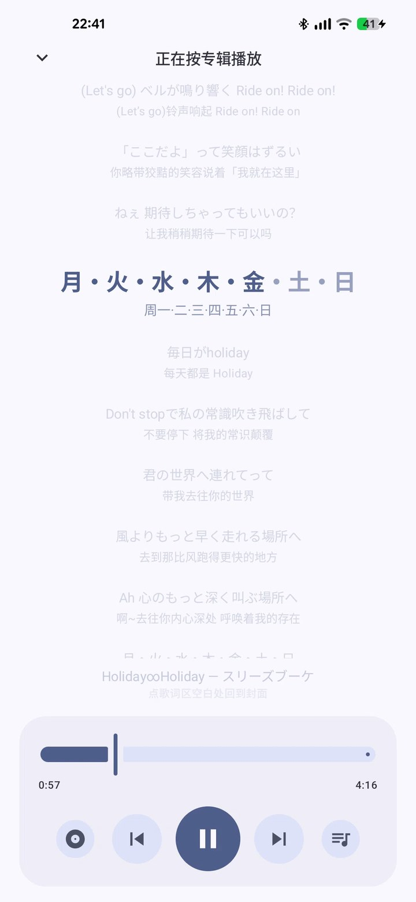
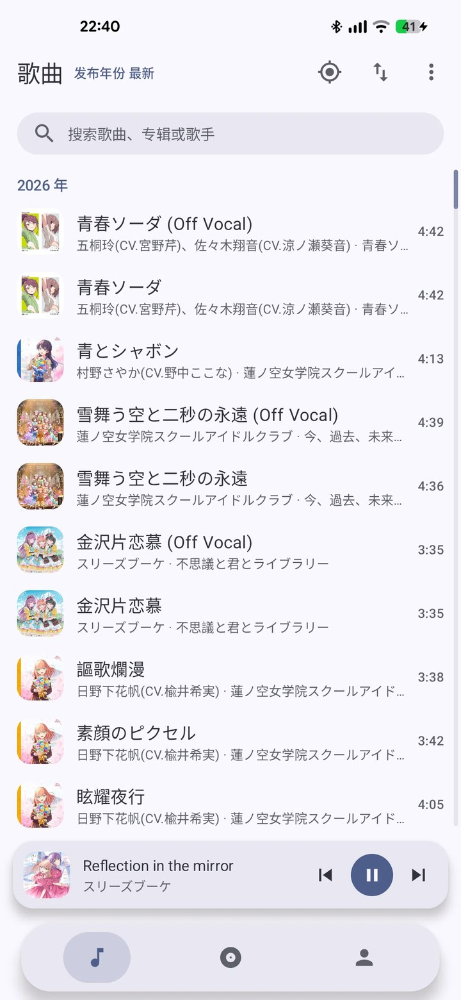
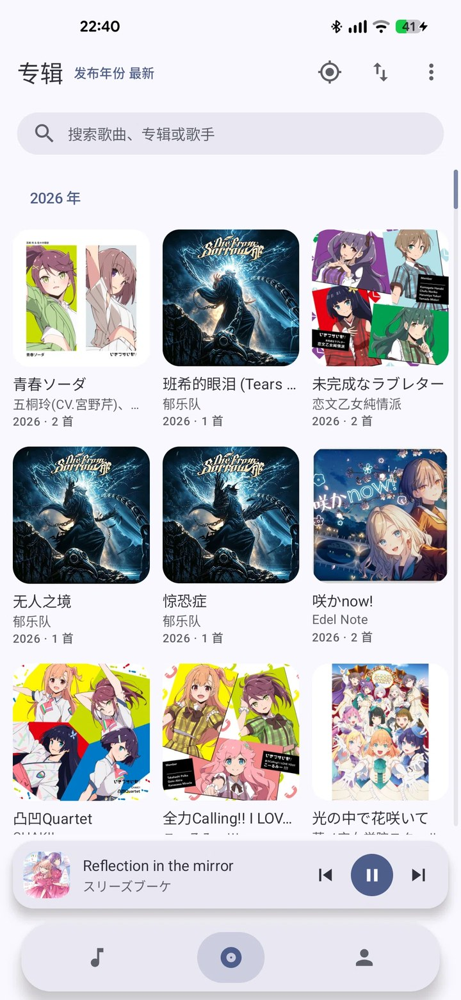
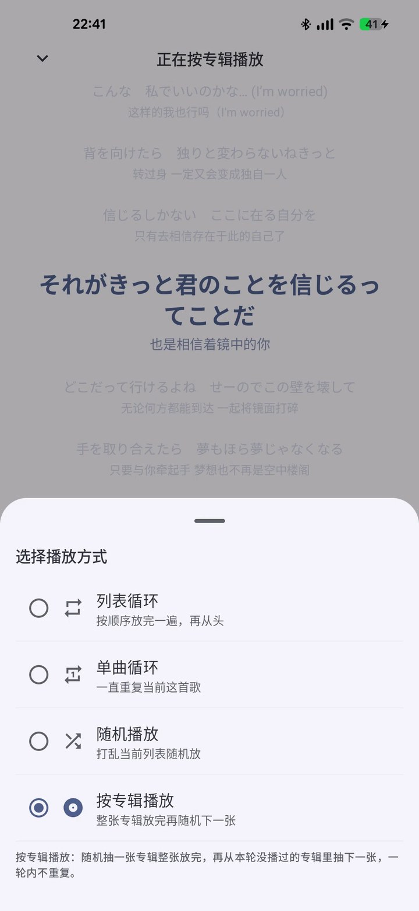
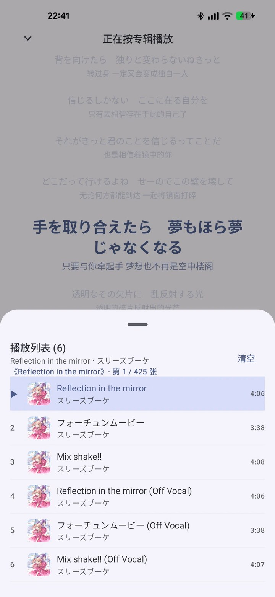
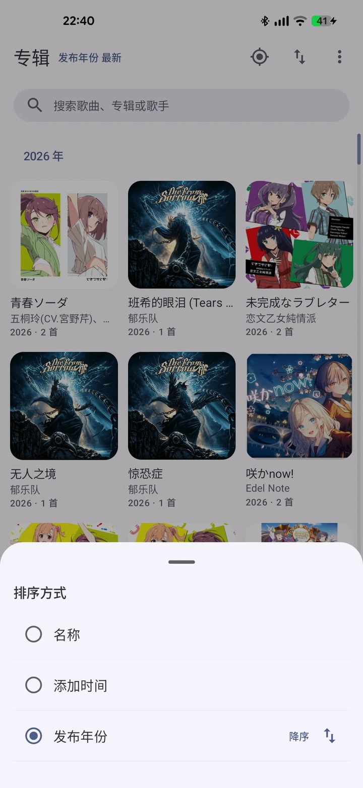

# 缪斯音乐（MuseMusic）

一个纯本地的 Android 音乐播放器。只读你手机里的音频文件，**不联网、不上传、不修改文件**。

[](LICENSE)


---

## 📸 界面预览

<table>
  <tr>
    <td align="center"><br><sub>播放页</sub></td>
    <td align="center"><br><sub>逐字歌词</sub></td>
    <td align="center"><br><sub>歌词（双语分行）</sub></td>
  </tr>
  <tr>
    <td align="center"><br><sub>歌曲列表</sub></td>
    <td align="center"><br><sub>专辑网格</sub></td>
    <td align="center"><br><sub>歌手（罗马音 A-Z）</sub></td>
  </tr>
  <tr>
    <td align="center"><br><sub>四种播放方式</sub></td>
    <td align="center"><br><sub>播放列表</sub></td>
    <td align="center"><br><sub>排序方式</sub></td>
  </tr>
</table>

---

## ✨ 功能特性

### 播放

- **四种播放方式**
  - 列表循环：按顺序放完一遍，再从头
  - 单曲循环：一直重复当前这首歌
  - 随机播放：打乱当前列表随机放
  - **按专辑播放**：先随机抽一张专辑，专辑内按**碟号（Disc）→ 音轨号（Track）**升序播放；
    整张放完再从本轮没播过的专辑里随机抽下一张，一轮内不重复；全部播完重新开始。
    —— 不随机单曲，也不跨专辑混排
- 后台播放（`MediaSessionService`），划掉最近任务后是否继续播放可在设置里切换
- 播放队列管理、拖动进度条、迷你播放器

### 媒体通知

- Media3 `MediaSession` + `DefaultMediaNotificationProvider`
- 通知栏媒体卡片：上一项 / 暂停 / 下一项、封面、进度

### 歌词

- 读取音频文件内嵌的歌词（FLAC / MP3）
- **逐字歌词**：按行内时间标签做卡拉 OK 式高亮
- **双语歌词换行**：原文与翻译分行显示，当前行放大高亮、其余半透明
- 播放页点空白区域进入歌词页

### 音乐库

- 本地扫描，支持 **FLAC / MP3** 元数据（含 **Disc 碟号**、**Track 曲目号**、专辑、年份、封面）
- 可按文件夹筛选，只显示指定目录
- **多语种 A-Z 排序**：中日文按罗马音、中文按拼音统一排序，不认识的字符归到 `#`
- **多歌手拆分**：`周杰伦、费玉清` 会分别归到两位歌手名下，分隔符可自定义
- 歌曲 / 专辑 / 歌手三个一级页，段标题吸顶
- 列表右侧**滚动条**：拖动快速跳转，滚动时气泡显示当前分段（滚动条本身不显示字母）
- 搜索：歌名 / 专辑 / 歌手，支持拼音首字母
- 长按任意歌曲可从库里移除（只影响显示与播放列表，**不删除文件**）

### 界面

- Jetpack Compose + **Material 3 / Material You（莫奈取色）**
- Android 12+ 跟随系统壁纸动态取色，低版本回退到内置靛蓝配色
- 浮动胶囊底栏、大圆角卡片分层、统一的圆角尺寸规范（`AppShapes`）

### 关于页面

- 展示 `versionName`
- 一键跳转本仓库

---

## 📱 系统要求

| 项 | 值 |
|---|---|
| 最低版本 | **Android 8.0（API 26）** |
| 目标版本 | **Android 14（API 34）** |
| 编译版本 | API 34 |
| 架构 | 通用（不含原生库，无 ABI 限制） |

> 权限：只需要**读取音频文件**（Android 13+ 为 `READ_MEDIA_AUDIO`，之前为 `READ_EXTERNAL_STORAGE`）。
> `POST_NOTIFICATIONS` 用于显示媒体通知。App **不申请任何网络权限**。

---

## 📦 版本信息

- 当前版本：**v1.0.0**
- `versionCode`：2
- `versionName`：1.0.0

> `versionCode` 每次发版递增（整数），`versionName` 是对外展示的文本。

---

## 🛠️ 编译构建

### 1. 克隆仓库

```bash
git clone https://github.com/45steel/musemusic.git
cd musemusic
```

### 2. 准备环境

| 需要 | 版本 |
|---|---|
| JDK | 17 或更高 |
| Android SDK | Platform 34 + Build-Tools 34 |
| Gradle | 用仓库自带的 wrapper，无需另装 |

在项目根目录建一个 `local.properties`，写上你的 SDK 路径：

```properties
sdk.dir=/path/to/Android/sdk
```

### 3. 构建

```bash
# 调试版
./gradlew assembleDebug

# 发布版
./gradlew assembleRelease
```

产物位置：

```
app/build/outputs/apk/debug/app-debug.apk
app/build/outputs/apk/release/app-release.apk
```

> **关于签名**：release 目前复用调试签名（`signingConfigs.getByName("debug")`），
> 方便自用与覆盖安装。要上架或正式分发请换成自己的 keystore。

### 4. 测试

```bash
./gradlew test
```

单元测试覆盖排序键、分词、歌词解析、播放方式映射、滚动条位置换算、恢复播放计划等纯逻辑部分。

---

## 🧱 技术栈

| 组件 | 版本 |
|---|---|
| Kotlin | 2.0.21 |
| Jetpack Compose BOM | 2024.09.03（Material3 1.3.0） |
| Android Gradle Plugin | 8.5.2 |
| Gradle | 8.9 |
| Media3（ExoPlayer + MediaSession） | 1.4.1 |
| Navigation Compose | 2.8.1 |
| Coil（封面加载） | 2.7.0 |
| DataStore Preferences | 1.1.1 |

---

## 📂 项目结构

```
app/src/main/java/com/musemusic45/
├── data/
│   ├── media/          # 扫描、元数据、歌词解析、搜索索引
│   ├── model/          # Song / Album / Artist / PlayMode / SortSpec
│   ├── prefs/          # DataStore 设置持久化
│   └── repository/     # 聚合、排序、分段
├── playback/           # PlaybackService / PlaybackController / 队列重建
└── ui/
    ├── albums/ artists/ songs/ search/ settings/ player/
    ├── components/     # 迷你播放器、浮动底栏、滚动条等复用件
    ├── theme/          # 配色、圆角规范、歌词配色
    └── AppRoot.kt      # 导航与整体骨架
```

---

##喂喂🐳

https://afdian.com/a/45steel

---

## ⚠️ 已知限制

- **不联网**：没有在线歌词、没有封面补全、没有云同步，这是刻意的设计
- **预测式返回未启用**：targetSdk 34 下未开启 `enableOnBackInvokedCallback`，
  应用内返回使用普通的淡入+位移过渡（300ms），并在过渡期间屏蔽输入以防误触
- 只扫描音频文件里**自带**的元数据与歌词；没有对应字段的文件不会显示歌词
- 排序用的罗马音/拼音转换基于内置规则，极少数生僻字可能落到 `#`

---

## 📄 许可证

[MIT](LICENSE) © 2026 45steel
